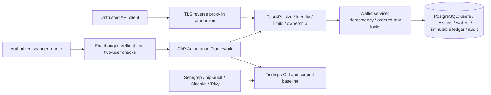

# Architecture and invariants

## Money movement

INR uses integer minor units (100 minor units = INR 1). Only INR is supported. No rounding, exchange rates, payment settlement, fees or holds are modeled. Each completed movement is a transfer row plus exactly two immutable entries. User balances are cached ledger sums with a nonnegative database CHECK. Simulated funding debits the single system treasury, which may go negative, and credits an owned user wallet. The treasury is not visible as a user wallet or valid transfer recipient.

The API checks source ownership, takes a PostgreSQL transaction-scoped advisory lock on the user/key digest, checks the content hash, then locks both wallet rows in UUID order using FOR UPDATE. Identical retries return the original immutable result, including after later movements; changed content returns 409. Failed requests do not consume a key. Advisory-lock hash collisions can serialize unrelated requests but cannot mix their keys or content.

The balance update, transfer, entries and success audit commit in one transaction **before** sending a successful response. Deferred constraint triggers verify entry count, signs, amount, source ownership and cached balance sums at commit; updates/deletes of ledger and audit rows are rejected. This protects across processes and API replicas. Failed requests produce a separate denial audit after rollback. A database outage can prevent denial auditing; an audit-write-failed structured event identifies this limitation.

## Authentication and resource ownership

Local authentication uses maintained Argon2id hashing, bounded passphrases, randomly generated bearer sessions, SHA-256 session digests, expiration, logout and uniform login failures. No signing key or invented cryptographic protocol is used. Credentials are never stored as plaintext. Each wallet route checks authenticated ownership. A transaction is visible to the owner of either participating user wallet; a funding transaction is visible only to its funded wallet owner. There is no online admin role or arbitrary ledger API.

Registration, login and money movement have PostgreSQL-backed fixed-window rate limits; generic API requests have an IP limit. The API uses the socket peer, never untrusted forwarding headers. TLS ingress should enforce additional per-client controls and trusted proxy handling. Rate buckets are hashed and retained until the cleanup command deletes expired buckets.

## Boundaries and deployment

Compose publishes only the API on loopback through an additional host bridge; PostgreSQL, migrations and ZAP use only the internal network. The API bridges the host and internal networks. The scanner has no external egress. API and migration containers run as UID 10001, have read-only root filesystems, temporary /tmp, dropped capabilities and no-new-privileges. Only selected application/migration files are copied into the image; teaching fixtures, reports and local credentials are excluded. Migration and runtime credentials are deliberately shared only in the local Compose demo. Production must split them using docs/runtime-grants.sql, verified DB TLS and a secrets manager.

ZAP imports a filtered OpenAPI document without external references or remote servers. The routine profile only imports GET operations; active scans use an explicit disposable target. Host and container scan preflights occur before HTTP calls. The report CLI escapes HTML, redacts common tokens, keeps raw tools separate, and only marks a baseline finding fixed when its same tool/scope completed successfully.
